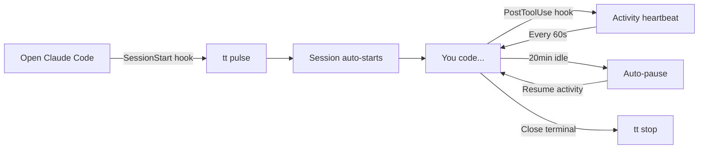
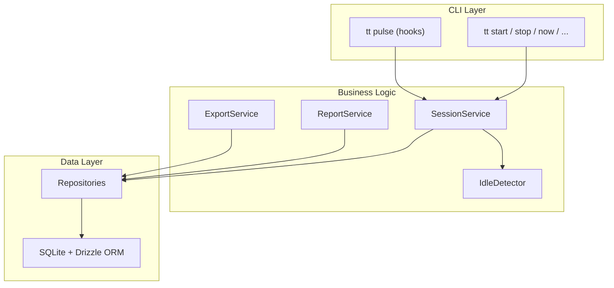
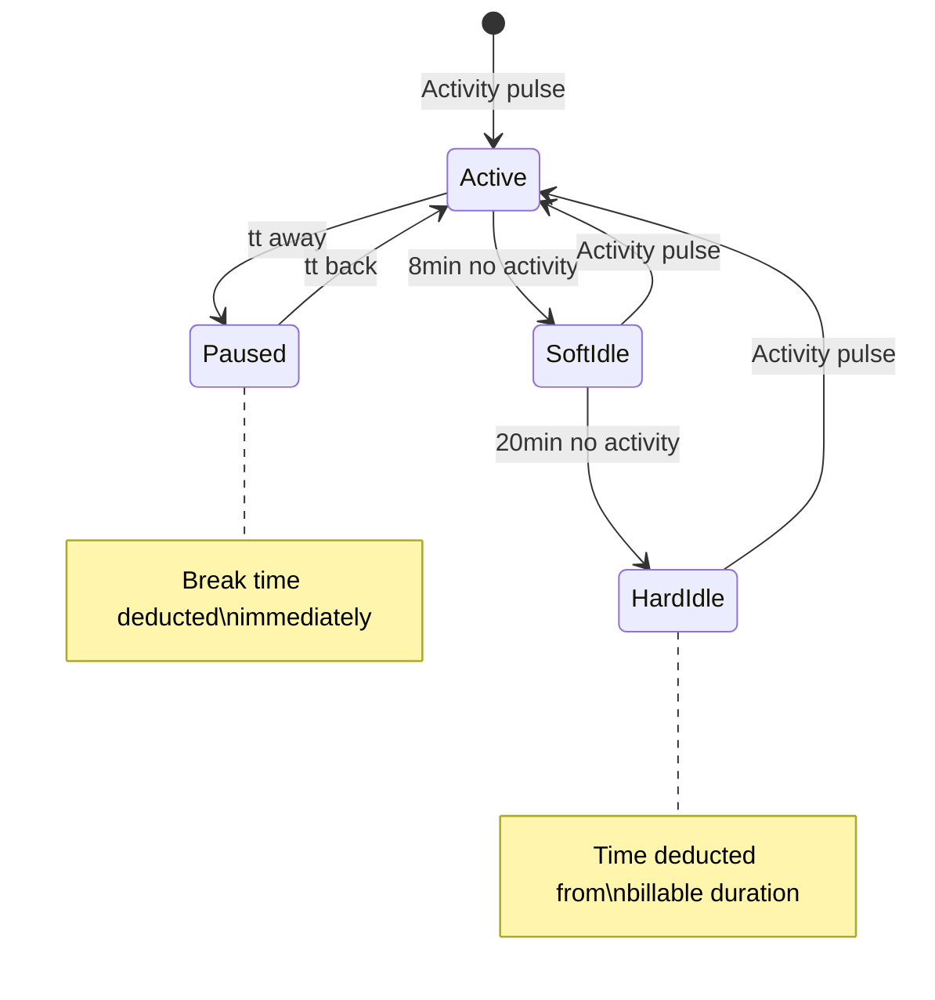

# tt — Time Tracking for Developers

Effortless, accurate time tracking that works passively in the background. Built for freelance developers who use [Claude Code](https://docs.anthropic.com/en/docs/claude-code).

```
$ tt now
▶ client-project  1h 23m (today: 4h 15m)
```

**No browser tabs. No manual timers. No context switching.** Open your terminal, start coding, and `tt` handles the rest.

## How It Works



`tt` hooks into Claude Code's lifecycle events. When you open a terminal in a project directory, tracking starts. As you work, activity pulses keep the session alive. Step away for 20 minutes? Time pauses automatically. Come back? It resumes. Close the terminal? Session stops.

Your time data lives in a local SQLite database at `~/.tt/tt.db` — no cloud, no accounts, no sync complexity.

## Install

```bash
# Clone and build
git clone https://github.com/aiwithabidi/time-tracker.git
cd time-tracker
bun install && bun run build

# Install globally + set up Claude Code hooks
./dist/tt setup
```

The `setup` command:
- Copies the binary to `~/.tt/bin/tt`
- Installs hook scripts to `~/.tt/hooks/`
- Prints the Claude Code configuration to add to `~/.claude/settings.json`

> **Requires [Bun](https://bun.sh)** — `curl -fsSL https://bun.sh/install | bash`

## Quick Start

```bash
# Manual tracking (works immediately after install)
tt start                    # Start tracking in current project
tt now                      # Check status
tt stop                     # Stop tracking

# Reports
tt today                    # Today's time by project
tt week                     # Weekly breakdown
tt week --billable          # With dollar amounts
tt log --from this-week     # Session history

# After running `tt setup` and adding hooks to Claude Code:
# Everything is automatic — just open your terminal and code
```

## Commands

### Session Control

| Command | Description |
|---------|-------------|
| `tt start` | Start tracking (auto-detects project from git) |
| `tt stop` | Stop the current session |
| `tt now` | Show active session status |
| `tt away` | Take a break (pause tracking) |
| `tt back` | Resume after a break |

### Notes & Tags

| Command | Description |
|---------|-------------|
| `tt note "fixed auth bug"` | Add a note to current session |
| `tt tag billable` | Tag the current session |
| `tt tag -r billable` | Remove a tag |

### Reports & Export

| Command | Description |
|---------|-------------|
| `tt today` | Today's time by project |
| `tt week` | This week's report |
| `tt week --billable` | Include dollar amounts |
| `tt log` | Full session history |
| `tt log --project client-a --from 2026-01-01` | Filtered history |
| `tt projects` | All projects with weekly totals |
| `tt last` | Last completed session |
| `tt export csv --project client-a --from 2026-01-01` | Export to CSV |

### Session Correction

| Command | Description |
|---------|-------------|
| `tt edit <id> --start 09:30 --end 17:00` | Fix times on a past session |
| `tt edit <id> --project other-project` | Reassign to different project |
| `tt split <id> 12:00` | Split a session at noon |
| `tt merge <id1> <id2>` | Merge two adjacent sessions |
| `tt undo` | Undo the last operation |

> Session IDs are the first 8 characters shown in `tt log`.

## Architecture



**Clean layers, no magic:**
- **CLI** — Gunshi command definitions, formatting, user I/O
- **Core** — Pure business logic. Sessions, idle detection, reports, CSV export
- **Data** — Repository pattern over SQLite. Drizzle ORM for type-safe queries

## Project Detection

`tt` automatically figures out which project you're working on:

1. **Config alias** (highest priority) — Match directory to a configured project
2. **Git root** (fallback) — Use the git repository name as the project slug
3. **Manual flag** — `tt start --project my-project`

## Idle Detection



- **Active** — Working normally, time accumulates
- **Soft idle** (8min) — Warning shown in `tt now`, no deduction yet
- **Hard idle** (20min) — Time auto-paused, excess deducted from billable hours
- **Paused** — Manual break via `tt away`, deducted immediately

Thresholds are configurable in `~/.tt/config.json`.

## Configuration

Create `~/.tt/config.json` to configure projects and rates:

```json
{
  "projects": {
    "~/code/client-a": {
      "slug": "client-a",
      "displayName": "Client A Website",
      "clientName": "Client A Inc",
      "hourlyRate": 150,
      "currency": "USD"
    }
  },
  "idle": {
    "softIdleMinutes": 8,
    "hardIdleMinutes": 20
  }
}
```

## Claude Code Slash Commands

If you use Claude Code, `tt` ships with slash commands that work inside conversations:

| Command | What it does |
|---------|-------------|
| `/tt` | Show current tracking status |
| `/tt:start` | Start tracking |
| `/tt:stop` | Stop tracking |
| `/tt:week` | Weekly report |
| `/tt:projects` | List all projects |
| `/tt:note meeting notes` | Add a note |
| `/tt:edit <id> --start 09:00` | Edit a session |

These are Claude Code [skills](https://docs.anthropic.com/en/docs/claude-code/skills) that invoke the `tt` binary directly — no AI processing needed, instant results.

## CSV Export

Export your time data for invoicing:

```bash
# Export all time for a project in a date range
tt export csv --project client-a --from 2026-01-01 --to 2026-01-31

# Preview what would be exported
tt export csv --project client-a --from 2026-01-01 --dry-run

# Pipe to a file
tt export csv --project client-a > january-hours.csv
```

**CSV columns:** `project, date, start_time, end_time, duration_hours, duration_human, notes, tags`

## Tech Stack

| Component | Choice | Why |
|-----------|--------|-----|
| Runtime | [Bun](https://bun.sh) | Fast startup (<100ms), built-in SQLite, single-file compile |
| Database | SQLite (WAL mode) | Local-first, zero config, portable |
| ORM | [Drizzle](https://orm.drizzle.team) | Type-safe queries, lightweight |
| CLI | [Gunshi](https://github.com/poyoho/gunshi) | Lazy-loaded subcommands for fast startup |
| Dates | [Luxon](https://moment.github.io/luxon/) | Timezone-aware, reliable date math |
| Validation | [Zod](https://zod.dev) | Runtime type safety for config and input |

## License

MIT - see [LICENSE](./LICENSE)

---

Built by [Abidi](https://github.com/aiwithabidi) at [AgxntSix](https://agxntsix.ai) with [Claude Code](https://docs.anthropic.com/en/docs/claude-code).
