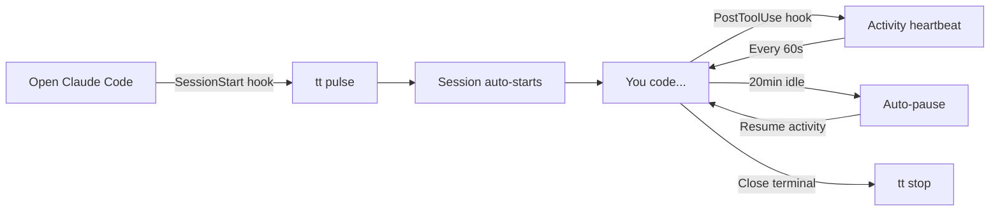
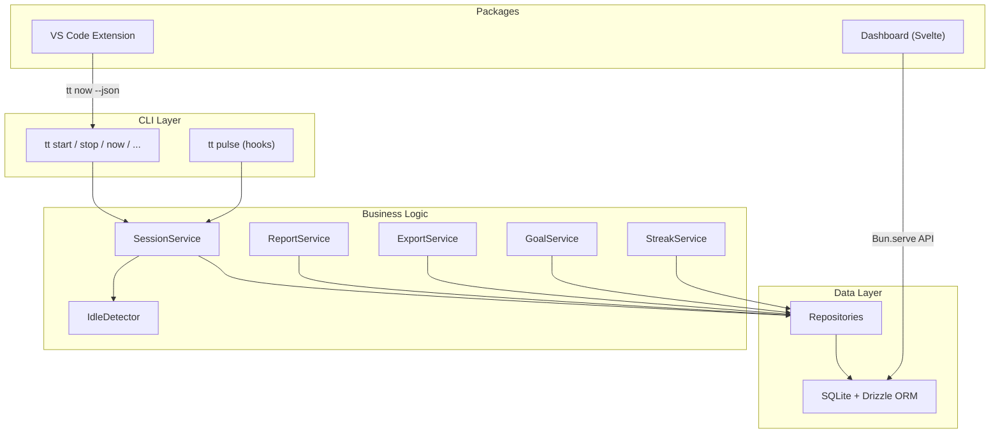
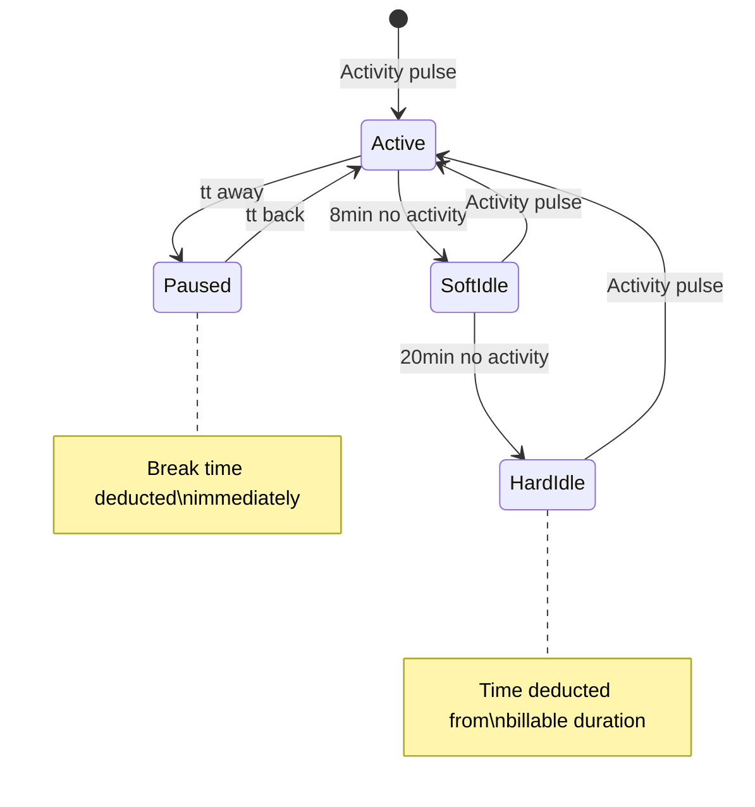

# tt -- Time Tracking for Developers

[](https://github.com/aiwithabidi/time-tracker/actions/workflows/ci.yml)

Effortless, accurate time tracking that works passively in the background. Built for freelance developers who use [Claude Code](https://docs.anthropic.com/en/docs/claude-code), VS Code, Cursor, or the terminal.

```
$ tt now
> client-project  1h 23m (today: 4h 15m) [goal: 71%]
```

**No browser tabs. No manual timers. No context switching.** Open your terminal, start coding, and `tt` handles the rest.

## How It Works



`tt` hooks into Claude Code's lifecycle events. When you open a terminal in a project directory, tracking starts. As you work, activity pulses keep the session alive. Step away for 20 minutes? Time pauses automatically. Come back? It resumes. Close the terminal? Session stops.

The VS Code extension adds passive tracking on file save and editor focus -- no hooks required.

Your time data lives in a local SQLite database at `~/.tt/tt.db` -- no cloud, no accounts, no sync complexity.

## Install

```bash
# Clone and build
git clone https://github.com/aiwithabidi/time-tracker.git
cd time-tracker
bun install && bun run build

# Install globally + set up Claude Code hooks
./dist/tt setup
```

The `setup` command:
- Copies the binary to `~/.tt/bin/tt`
- Installs hook scripts to `~/.tt/hooks/`
- Prints the Claude Code configuration to add to `~/.claude/settings.json`

> **Requires [Bun](https://bun.sh)** -- `curl -fsSL https://bun.sh/install | bash`

## Quick Start

```bash
# Manual tracking (works immediately after install)
tt start                    # Start tracking in current project
tt now                      # Check status
tt stop                     # Stop tracking

# Set a daily goal and track your streak
tt goal set 6h              # Target 6 hours per day
tt streak                   # View your tracking streak

# Reports
tt today                    # Today's time by project
tt week                     # Weekly breakdown
tt week --billable          # With dollar amounts
tt log --from this-week     # Session history

# Dashboard
tt dashboard                # Open analytics dashboard in browser

# After running `tt setup` and adding hooks to Claude Code:
# Everything is automatic -- just open your terminal and code
```

## Commands

### Session Control

| Command | Description |
|---------|-------------|
| `tt start` | Start tracking (auto-detects project from git) |
| `tt stop` | Stop the current session |
| `tt now` | Show active session status (includes goal progress) |
| `tt now --json` | Machine-readable output for editor integrations |
| `tt away` | Take a break (pause tracking) |
| `tt back` | Resume after a break |

### Goals and Streaks

| Command | Description |
|---------|-------------|
| `tt goal set <duration>` | Set a daily time goal (`6h`, `4h30m`, `90m`, `2h 15m`) |
| `tt goal show` | View goal progress with visual progress bar |
| `tt goal clear` | Remove the daily goal |
| `tt streak` | View tracking streak with 28-day ASCII heatmap |

### Notes and Tags

| Command | Description |
|---------|-------------|
| `tt note "fixed auth bug"` | Add a note to current session |
| `tt tag billable` | Tag the current session |
| `tt tag -r billable` | Remove a tag |

### Reports and Export

| Command | Description |
|---------|-------------|
| `tt today` | Today's time by project (includes goal progress) |
| `tt week` | This week's report |
| `tt week --billable` | Include dollar amounts |
| `tt log` | Full session history |
| `tt log --project client-a --from 2026-01-01` | Filtered history |
| `tt projects` | All projects with weekly totals |
| `tt last` | Last completed session |
| `tt export csv --project client-a --from 2026-01-01` | Export to CSV |
| `tt dashboard` | Open local analytics dashboard in browser |

### Session Correction

| Command | Description |
|---------|-------------|
| `tt edit <id> --start 09:30 --end 17:00` | Fix times on a past session |
| `tt edit <id> --project other-project` | Reassign to different project |
| `tt split <id> 12:00` | Split a session at noon |
| `tt merge <id1> <id2>` | Merge two adjacent sessions |
| `tt undo` | Undo the last operation |

### Analytics and Diagnostics

| Command | Description |
|---------|-------------|
| `tt logs` | Recent command events (last 25) |
| `tt logs --stats` | Usage frequency, avg latency, error rates |
| `tt logs --errors` | Show only failed commands |
| `tt logs --json` | Raw JSON for AI analysis |
| `tt logs -c start --from 2026-03-01` | Filter by command and date |
| `tt doctor` | Health check (20 checks + auto-repair) |
| `tt config list` | Show all configuration |
| `tt config set sourceRepo /path/to/time-tracker` | Set source repo for dashboard |
| `tt update` | Update to latest version from source |
| `tt update --check` | Check for updates without installing |

> Session IDs are the first 8 characters shown in `tt log`.

## Goals and Streaks

Set a daily time goal to stay on track:

```bash
tt goal set 6h          # Set a 6-hour daily goal
tt goal show            # View progress with a visual progress bar
tt goal clear           # Remove the goal
```

When a goal is set, progress is shown automatically in `tt now` and `tt today` output.

Track your consistency with streaks:

```bash
$ tt streak
Current streak: 12 days
Best streak:    34 days
Average daily:  5h 42m

  Jan 27 - Feb 23 (28 days)
  Mo Tu We Th Fr Sa Su
  .. .. .. .. ## ## ##
  ## ## ## ## ## ## ##
  ## ## ## ## ## ## ..
  ## ## ## ## ## ## ..
```

The heatmap uses intensity shading to show how much you tracked each day over the last 28 days.

## JSON Output

`tt now --json` returns machine-readable data for editor integrations and scripts:

```json
{
  "active": true,
  "project": "client-project",
  "durationMs": 4980000,
  "todayTotalMs": 15300000,
  "idleState": "active",
  "goalMinutes": 360,
  "goalPercent": 71
}
```

The VS Code extension uses this endpoint to power its status bar display.

## VS Code / Cursor Extension

The `tt` extension for VS Code brings passive time tracking to your editor. Located at `packages/vscode/`.

**Supported editors:** VS Code, Cursor, Windsurf, and any VS Code fork.

**Features:**
- **Passive tracking** -- sends pulses on file save and editor focus changes
- **Status bar** -- shows current project, elapsed time, and goal percentage
- **Zero config** -- auto-discovers the `tt` binary from config, `~/.tt/bin/tt`, or PATH

**Settings:**

| Setting | Default | Description |
|---------|---------|-------------|
| `tt.enabled` | `true` | Enable or disable the extension |
| `tt.binaryPath` | (auto) | Path to the `tt` binary |
| `tt.statusBarInterval` | `30` | Status bar refresh interval in seconds |

**Install:**

```bash
cd packages/vscode
bun install
bun run build
# Install the generated .vsix file:
code --install-extension tt-time-tracker-*.vsix
# Or for Cursor:
cursor --install-extension tt-time-tracker-*.vsix
```

## Dashboard

`tt dashboard` opens a local analytics dashboard in your browser with a GitHub-inspired dark theme.

**Features:**
- Contribution heatmap (GitHub-style)
- Weekly time charts
- Session timeline
- Project breakdown
- Streak statistics

**Setup:**

The dashboard requires a `sourceRepo` config pointing to your local `time-tracker` clone:

```bash
tt config set sourceRepo /path/to/time-tracker
```

**Build and run:**

```bash
cd packages/dashboard
bun install
bun run build
tt dashboard              # Opens in your default browser
tt dashboard --port 8888  # Use a custom port
```

Built with Svelte 5 and Tailwind CSS v4, served by Bun.

## Architecture



**Clean layers, no magic:**
- **CLI** -- Gunshi command definitions, formatting, user I/O
- **Core** -- Pure business logic. Sessions, idle detection, reports, goals, streaks, CSV export
- **Data** -- Repository pattern over SQLite. Drizzle ORM for type-safe queries
- **Packages** -- VS Code extension (passive tracking), dashboard (Svelte analytics UI)

## Project Structure

```
src/
  cli/           Command definitions (gunshi), formatting, helpers
    commands/    One file per command (start.ts, stop.ts, now.ts, goal.ts, streak.ts, ...)
  core/          Pure business logic
    session/     Session lifecycle, idle detection
    reports/     Report generation
    export/      CSV export
    review/      Work review generation
    goals/       Daily goal tracking
    streaks/     Streak calculation and heatmap
    shared/      Shared utilities (time math, duration formatting)
  services/      Service factory layer (creates services with DB access)
  db/            SQLite schema (Drizzle ORM), repositories, migrations
  config/        Config loading, Zod schemas, types
  hooks/         Claude Code hook scripts (pulse, session lifecycle)
packages/
  vscode/        VS Code / Cursor extension (TypeScript, esbuild)
  dashboard/     Local analytics dashboard (Svelte 5, Tailwind CSS v4)
tests/
  cli/           CLI command tests
  core/          Business logic tests
  integration/   End-to-end integration tests
skills/          Claude Code slash commands (/tt, /tt:start, /tt:week, ...)
```

## Project Detection

`tt` automatically figures out which project you're working on:

1. **Config alias** (highest priority) -- Match directory to a configured project
2. **Git root** (fallback) -- Use the git repository name as the project slug
3. **Manual flag** -- `tt start --project my-project`

## Idle Detection



- **Active** -- Working normally, time accumulates
- **Soft idle** (8min) -- Warning shown in `tt now`, no deduction yet
- **Hard idle** (20min) -- Time auto-paused, excess deducted from billable hours
- **Paused** -- Manual break via `tt away`, deducted immediately

Thresholds are configurable in `~/.tt/config.json`.

## Configuration

Create `~/.tt/config.json` to configure projects and rates:

```json
{
  "projects": {
    "~/code/client-a": {
      "slug": "client-a",
      "displayName": "Client A Website",
      "clientName": "Client A Inc",
      "hourlyRate": 150,
      "currency": "USD"
    }
  },
  "idle": {
    "softIdleMinutes": 8,
    "hardIdleMinutes": 20
  },
  "goal": {
    "dailyMinutes": 360
  },
  "sourceRepo": "/path/to/time-tracker"
}
```

The `goal` field is managed by `tt goal set` and `tt goal clear`. The `sourceRepo` field is required for `tt dashboard`.

## Claude Code Slash Commands

If you use Claude Code, `tt` ships with slash commands that work inside conversations:

| Command | What it does |
|---------|-------------|
| `/tt` | Show current tracking status |
| `/tt:start` | Start tracking |
| `/tt:stop` | Stop tracking |
| `/tt:week` | Weekly report |
| `/tt:projects` | List all projects |
| `/tt:note meeting notes` | Add a note |
| `/tt:edit <id> --start 09:00` | Edit a session |

These are Claude Code [skills](https://docs.anthropic.com/en/docs/claude-code/skills) that invoke the `tt` binary directly -- no AI processing needed, instant results.

## CSV Export

Export your time data for invoicing:

```bash
# Export all time for a project in a date range
tt export csv --project client-a --from 2026-01-01 --to 2026-01-31

# Preview what would be exported
tt export csv --project client-a --from 2026-01-01 --dry-run

# Pipe to a file
tt export csv --project client-a > january-hours.csv
```

**CSV columns:** `project, date, start_time, end_time, duration_hours, duration_human, notes, tags`

## Auto-Update

`tt` can update itself from source:

```bash
tt update           # Pull, build, and install the latest version
tt update --check   # Just check if an update is available
```

The update mechanism:
1. **Verifies the remote origin** matches the expected GitHub repository (supply-chain protection)
2. **Pulls** the latest changes from `origin/main`
3. **Installs** dependencies and **builds** a new binary
4. **Atomically replaces** the installed binary (write to `.tmp`, then rename)
5. **Rolls back** automatically if the build fails (resets to the previous commit)

A background check runs on each `tt` invocation (throttled to once per hour) and shows a status indicator when an update is available.

## Development

```bash
# Prerequisites
bun --version  # Requires Bun (https://bun.sh)

# Setup
git clone https://github.com/aiwithabidi/time-tracker.git
cd time-tracker
bun install

# Development workflow
bun run dev -- now              # Run commands without compiling
bun run typecheck               # Type checking
bun run test:unit               # Unit tests with coverage
bun run test:integration        # Integration tests
bun run test                    # All tests
bun run build                   # Compile to native binary (dist/tt)

# Build packages
cd packages/vscode && bun install && bun run build    # VS Code extension
cd packages/dashboard && bun install && bun run build  # Dashboard
```

See [CONTRIBUTING.md](./CONTRIBUTING.md) for full contributor guidelines.

## Tech Stack

| Component | Choice | Why |
|-----------|--------|-----|
| Runtime | [Bun](https://bun.sh) | Fast startup (<100ms), built-in SQLite, single-file compile |
| Database | SQLite (WAL mode) | Local-first, zero config, portable |
| ORM | [Drizzle](https://orm.drizzle.team) | Type-safe queries, lightweight |
| CLI | [Gunshi](https://github.com/poyoho/gunshi) | Lazy-loaded subcommands for fast startup |
| Dates | [Luxon](https://moment.github.io/luxon/) | Timezone-aware, reliable date math |
| Validation | [Zod](https://zod.dev) | Runtime type safety for config and input |
| Testing | [Vitest](https://vitest.dev) | Fast, Bun-compatible, coverage built-in |
| Dashboard | [Svelte 5](https://svelte.dev) + [Tailwind CSS v4](https://tailwindcss.com) | Minimal bundle, modern reactivity |
| Extension | VS Code Extension API | Native editor integration |

## License

MIT - see [LICENSE](./LICENSE)

---

Built by [Abidi](https://github.com/aiwithabidi) at [AgxntSix](https://agxntsix.ai) with [Claude Code](https://docs.anthropic.com/en/docs/claude-code).
